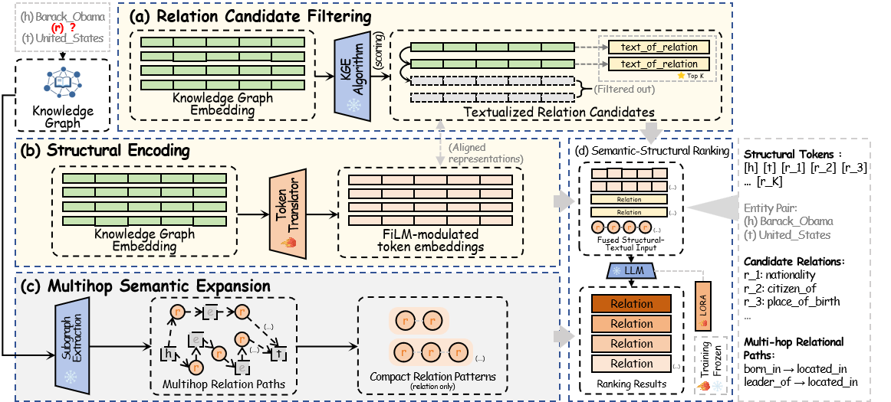
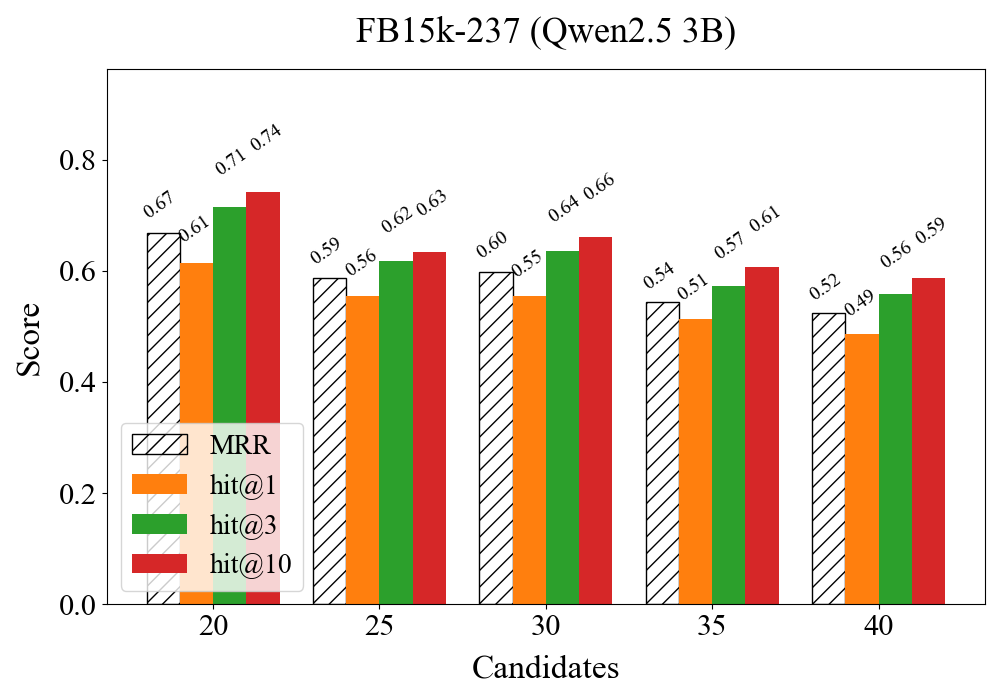
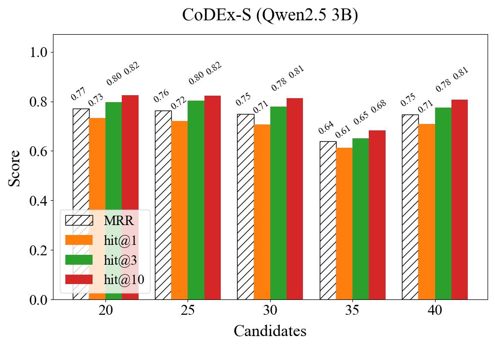
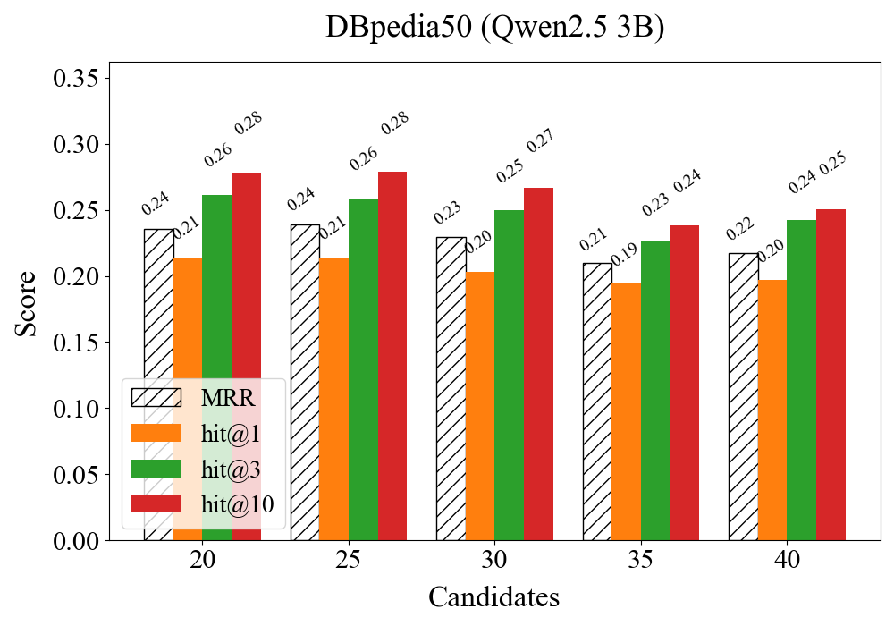
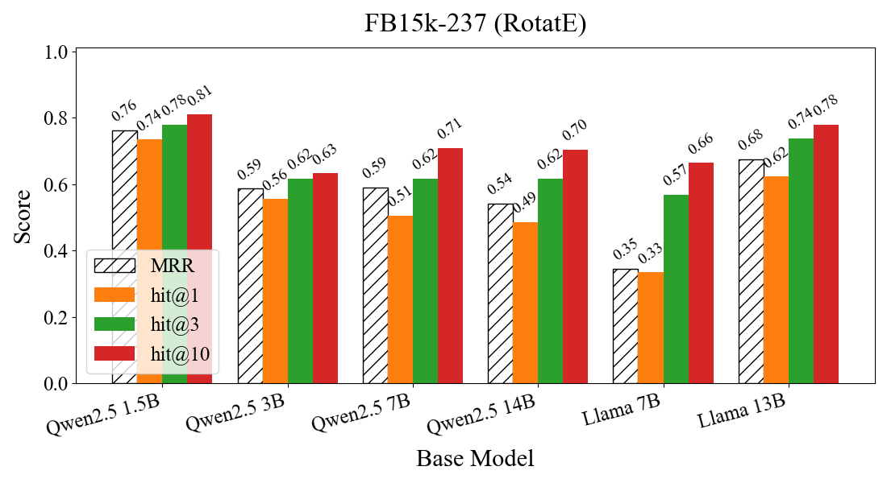
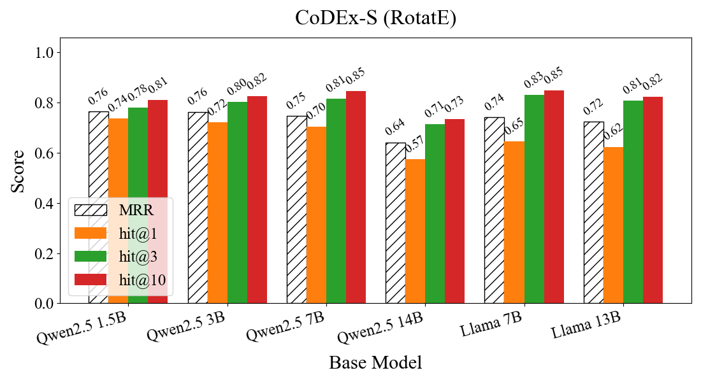
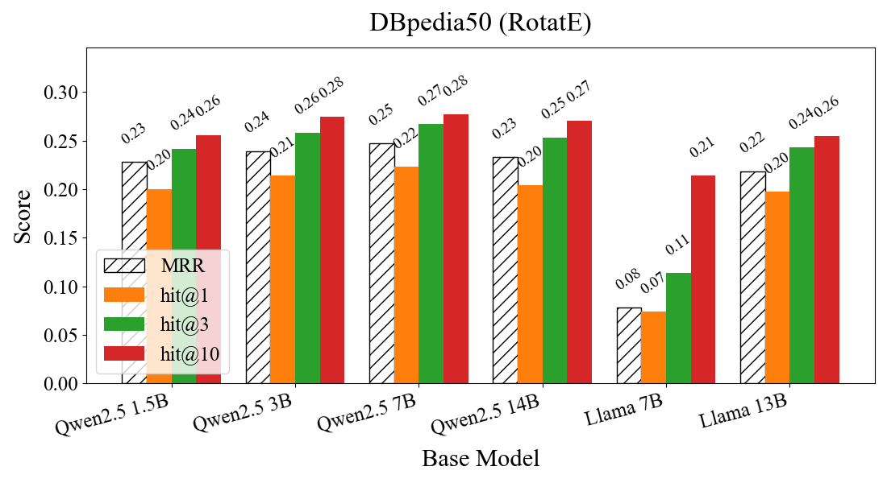
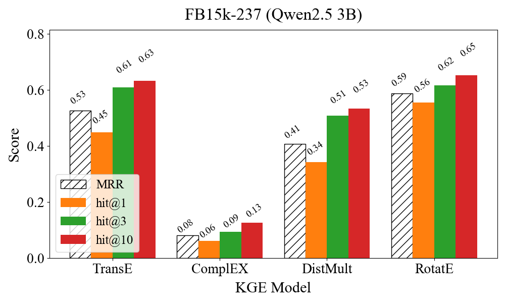
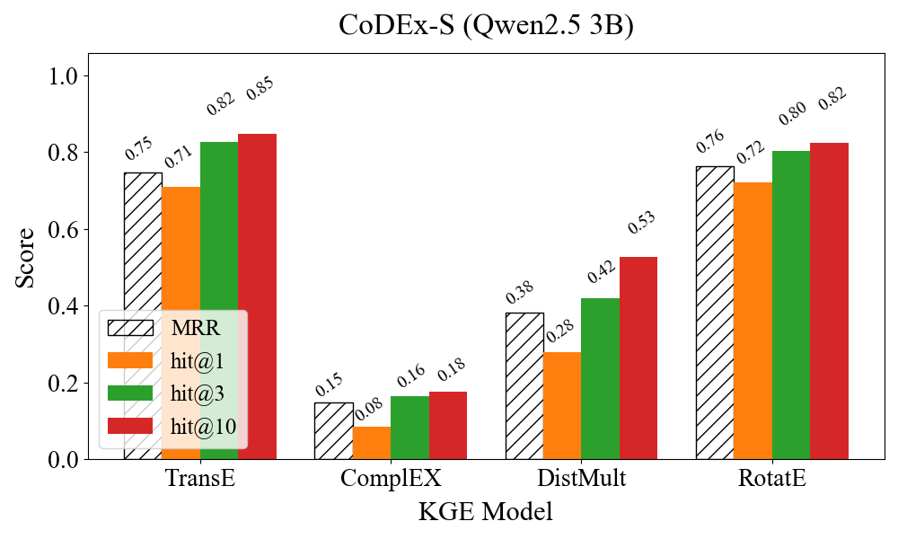
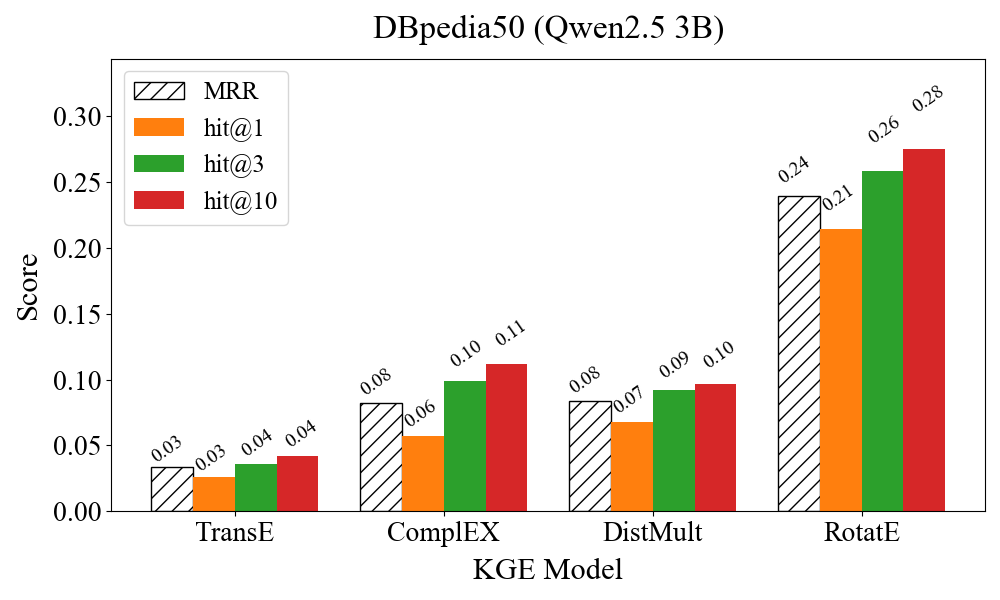

# DUAL-RP: Dual Relational Path Modeling for Knowledge Graph Reasoning

This repository provides supplementary materials for our IJCNN 2026 paper:

**"DUAL-RP: Dual Relational Path Modeling for Knowledge Graph Reasoning"**

---

## 📖 Overview

Due to space limitations in the main paper, we provide additional materials here to improve clarity and completeness, including:

- Case study analysis
- Additional experimental observations
- Visualization of key factors affecting performance

---

## 🧠 Framework Overview

  

---

## 🔍 Case Study: Analysis of Key Factors

To better understand the behavior of DUAL-RP, we analyze three key factors:

- Candidate set size
- Backbone language model
- KGE method

All experiments are conducted under identical settings on:

- FB15k-237
- CoDEx-S
- DBpedia50

---

### 🔹 Effect of Candidate Number

  
  
  

We observe that:

- Increasing candidate size from **20 → 40** consistently degrades performance
- The drop is most significant on **CoDEx-S**
- Larger candidate sets introduce more semantically similar relations

Interestingly:

> The proportion of gold relations within top-k increases as candidate size grows

This indicates that:

- Performance degradation is **not caused by recall issues**
- Instead, it is due to **increased ranking difficulty**

👉 The model must distinguish between more fine-grained and similar relations.

Overall, setting candidate size to **25** provides a good trade-off between:

- Accuracy  
- Fairness  
- Computational cost  

---

### 🔹 Effect of Backbone Language Model

  
  
  

We evaluate different backbone models across scales.

Key observations:

- Performance improves from **1.5B → 7B**
- Gains diminish beyond **3B**
- **Qwen models outperform LLaMA** at comparable scales

This suggests:

- Instruction tuning and factual consistency benefit reasoning
- Larger models do not always yield proportional improvements

👉 **Qwen2.5-3B** provides the best balance between:

- Performance  
- Efficiency  
- Stability  

---

### 🔹 Effect of KGE Method

  
  
  

Different KGE methods introduce different structural inductive biases.

We observe:

- **TransE**: simple but struggles with complex relations  
- **DistMult / ComplEx**: partially handle symmetry but limited expressiveness  
- **RotatE**: consistently achieves the best or near-best performance  

This is because:

- RotatE models diverse relational patterns effectively  
- Its geometric formulation aligns well with LLM representations  

👉 This makes it particularly suitable for **semantic–structural fusion** in DUAL-RP.

---

## 📊 Summary

From these analyses, we conclude:

- Candidate size mainly affects **ranking difficulty**
- Backbone models impact **semantic representation quality**
- KGE methods determine **structural reasoning capability**

These factors jointly influence the effectiveness of DUAL-RP.

---

## 📌 Notes

- All results are obtained under identical training and inference settings
- This analysis was originally part of the main paper but removed due to page limits
- We release it here for transparency and completeness
